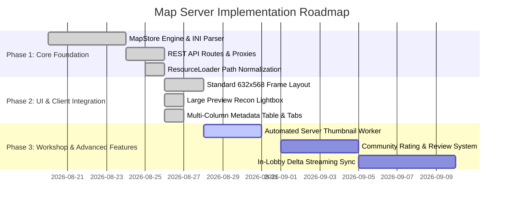

# Map Server Architecture & Implementation Plan

## 1. Executive Summary

This document defines the architecture, protocol specification, security model, and implementation roadmap for the **Red Alert 2 Web Map Server Ecosystem**. 

Historically, players were restricted to stock Westwood maps bundled in static VFS archives or suffered lobby disconnects when custom maps were missing. The Map Server introduces an authoritative, high-throughput, content-addressed map distribution pipeline supporting single-file map downloads, pre-bundled `.pkt` archives, in-lobby peer synchronization, and community workshop capabilities.

---

## 2. System Architecture

```
                                  +---------------------------------------+
                                  |            Game Client(s)             |
                                  |  (MapSelScreen, Lobby, ResourceLoader)|
                                  +-------------------+-------------------+
                                                      |
                                          HTTP / HTTPS| (REST + Range Requests)
                                                      v
                                  +---------------------------------------+
                                  |       Vite / Reverse Proxy Gateway    |
                                  |     (/maps/*, /maptransfer/*)         |
                                  +-------------------+-------------------+
                                                      |
                                                      v
                                  +---------------------------------------+
                                  |          Node.js Map Server           |
                                  |  (Express Routes: mapRoutes.ts)       |
                                  +---------+-------------------+---------+
                                            |                   |
                     +----------------------+                   +----------------------+
                     v                                                                 v
+------------------------------------------+                       +------------------------------------------+
|          MapStore (MapStore.ts)          |                       |         Validation & Parsing Pipeline    |
| - In-Memory Map Index & Metadata Cache   |                       | - INI Section Validator (Basic, Map, Way)|
| - Content-Addressed Hash Registry        |                       | - MapFile / Theater Verification         |
| - PKT Bundle Builder (maps.pkt)          |                       | - Malicious Trigger / Script Filter      |
+--------------------+---------------------+                       +------------------------------------------+
                     |
                     v
+------------------------------------------+
|         Physical Storage Subsystem       |
| - Uploads Store: data/maps/              |
| - Packaged Bundles: data/bundles/        |
| - Thumbnails Cache: data/thumbnails/     |
+------------------------------------------+
```

---

## 3. Core Components

### 3.1. Server Subsystem (`server/src/map/MapStore.ts`)
The `MapStore` manages the indexing, deduplication, content addressing, and retrieval of maps:
- **Indexing**: Scans map storage directories on boot and dynamically tracks filesystem updates.
- **Content Addressing**: Computes SHA-256 and MD5 hashes for all map files to guarantee deterministic multiplayer synchronization.
- **Metadata Extraction**: Extracts critical scenario parameters on ingest:
  - Scenario Name (`[Basic] -> Name`)
  - Maximum Players / Spawn Count (`[Waypoints]`)
  - Theater (`[Map] -> Theater`)
  - Dimensions (`[Map] -> Width`, `[Map] -> Height`)
  - Supported Game Modes (`[Basic] -> GameMode`)
- **PKT Archive Generation**: Compiles indexed maps into binary `.pkt` bundles for bulk client pre-fetching.

### 3.2. REST Endpoints (`server/src/routes/mapRoutes.ts`)
| Route | Method | Description | Cache Policy |
|---|---|---|---|
| `/maps/:mapName` | `GET` | Streams a single map file (`.map` or `.yrm`). Supports HTTP 206 Partial Content. | `public, max-age=86400` (immutable by hash) |
| `/maps` | `GET` | Returns paginated JSON list of available maps with metadata, player slots, theater, and rating stats. | `public, max-age=60, stale-while-revalidate=300` |
| `/maps/upload` | `POST` | Accepts multi-part map uploads (`.map`, `.yrm`), validates INI integrity, and indexes map. | `no-store` (Rate-limited) |
| `/maps.pkt` | `GET` | Downloads the compiled binary package bundle containing all official and verified community maps. | `public, max-age=3600` |
| `/maptransfer/:hash`| `GET` | P2P/Lobby fallback endpoint to fetch a specific map revision by content hash. | `public, max-age=604800` |

### 3.3. Client-Side Ingestion (`ResourceLoader.ts`, `MapFileLoader.ts`)
- **Root-Absolute Path Normalization**: Normalized URL handling so `/maps/*` and `/maps.pkt` resolve against server origin without double prefixing `resourceBaseUrl`.
- **Graceful Error Handling in Map Selection**: Failed map downloads (404/500) trigger non-fatal dialogs without force-popping the `MapSelScreen`, preventing lobby desync and UI disruption.
- **VFS / IndexedDB Caching**: Downloaded maps are stored in the client-side Virtual File System (VFS) and persisted to browser IndexedDB, eliminating redundant network roundtrips.

---

## 4. Map File Format & Validation Pipeline

### 4.1. Supported Formats
- `.map`: Red Alert 2 standard scenario format (Windows INI structure with base64/uncompressed isometric tile and overlay layers).
- `.yrm`: Yuri's Revenge scenario format with enhanced terrain layers and lighting tables.
- `.pkt`: Westwood package archive containing packed map files.

### 4.2. Ingestion Security & Sanitation
To protect against malicious map exploits, crashes, and server resource exhaustion:
1. **File Size Hard Caps**: Enforce maximum file size limit (5 MB per uncompressed map).
2. **Filename & Path Traversal Guard**: Sanitize all filenames, disallowing relative traversal characters (`..`, `/`, `\`) and null bytes.
3. **INI Section Integrity Check**:
   - Must contain valid `[Map]`, `[Basic]`, and `[Waypoints]` sections.
   - Enforce bounding limits on `Width` and `Height` ($20 \le \text{dim} \le 200$).
   - Verify spawn points contain at least 2 valid player start locations.
4. **Trigger & Action Sanitation**: Scan triggers for illegal memory overrides or unsupported engine opcodes that cause browser WebAssembly desyncs.

---

## 5. UI/UX Design Specifications

### 5.1. Standard Shell Viewport Conformance
The Map Selection interface renders inside the authentic Red Alert 2 Main Menu frame:
- **Frame Bounds**: Content canvas constrained precisely to `632px` width $\times$ `568px` height.
- **Right Sidebar Integration**: Top-right animated shutter preview (`SidebarPreview`), metallic action buttons (`Use Map`, `Cancel`), and dynamic metadata slots.

### 5.2. Screen Layout Architecture
```
+-------------------------------------------------------------------------------+
|                             SELECT ENGAGEMENT                                 |
+-------------------+----------------------+--------------------+---------------+
|   OFFICIAL MAPS   |  COMMUNITY BROWSER   |      FEATURED      | [⇅] Filter:All|
+-------------------+----------------------+--------------------+---------------+
| MAP NAME          | RATING | STATS       | TAGS               | THEATER       |
|-------------------+--------+-------------+--------------------+---------------|
| Little Big Lake(2)| ★★★★☆  | 50k / 1.2k  | 👥 2               | Desert Theater|
| Alaskan Oil Spill | ★★★★☆  | 50k / 1.2k  | 👥 2               | Desert Theater|
| El Dorado (2)     | ★★★★☆  | 30k / 1.2k  | 👥 2               | Desert Theater|
| May Day (2)       | ★★★☆☆  | 50k / 1.2k  | 👥 2               | Desert Theater|
| Anytown, Amerika  | ★★★★☆  | 50k / 1.4k  | 👥 4               | Urban Theater |
+-------------------------------------------------------------------------------+
| Search: [________________________]  Community Tag: [_________________________]|
+-------------------------------------------------------------------------------+
| Little Big Lake: Tactical 2-player engagement centered on oil derricks.       |
| Author: EA Los Angeles                                                        |
+-------------------------------------------------------------------------------+
```

### 5.3. Satellite Recon Lightbox (Large Preview Modal)
- Triggered by clicking the top-right sidebar preview radar or double-clicking any map entry.
- Built on Westwood `.message-box` styling with full tactical radar canvas.
- Features real-time toggleable grid overlays, spawn waypoint badges (`1`, `2`, `...`), terrain elevation highlights, and mission briefings.

---

## 6. Deployment & Configuration

### 6.1. Environment & Client Config (`public/config.ini`)
```ini
[Network]
mapsBaseUrl=/maps/
mapsPktUrl=/maps.pkt
mapTransferBaseUrl=/maptransfer/
mapUploadEnabled=true
```

### 6.2. Reverse Proxy Gateway (Nginx / Vite)
```nginx
location /maps/ {
    proxy_pass http://127.0.0.1:4000/maps/;
    proxy_set_header Host $host;
    proxy_cache MAP_CACHE;
    proxy_cache_valid 200 1d;
}

location /maptransfer/ {
    proxy_pass http://127.0.0.1:4000/maptransfer/;
    proxy_set_header Host $host;
}
```

---

## 7. Implementation Roadmap



### Phase 1: Core Foundation (Completed)
- [x] In-memory `MapStore` with metadata indexing and hash resolution.
- [x] REST endpoints (`/maps/:mapName`, `/maps/upload`, `/maps.pkt`, `/maptransfer/:hash`).
- [x] Client `ResourceLoader` root-path normalization.
- [x] Non-fatal map download error recovery in `MapSelScreen`.

### Phase 2: UI & Client Integration (Completed)
- [x] MainMenu shell standard layout (`632px × 568px` content canvas).
- [x] Multi-tabbed catalog browser (`OFFICIAL MAPS`, `COMMUNITY BROWSER`, `FEATURED`).
- [x] Satellite Recon Lightbox (`LargePreviewModal`) with grid and waypoint inspector.
- [x] Search and tag filtering.

### Phase 3: Workshop & Production Hardening (Next Steps)
- [ ] **Background Thumbnail Generator**: Node.js canvas worker to generate high-resolution radar PNGs automatically on map upload.
- [ ] **Community Rating & Stats Backend**: PostgreSQL/SQLite store recording play counts, download metrics, and 5-star user reviews.
- [ ] **In-Lobby Map Streaming**: Automatic broadcast and delta sync of host's custom map to all joined lobby clients prior to launch countdown.
